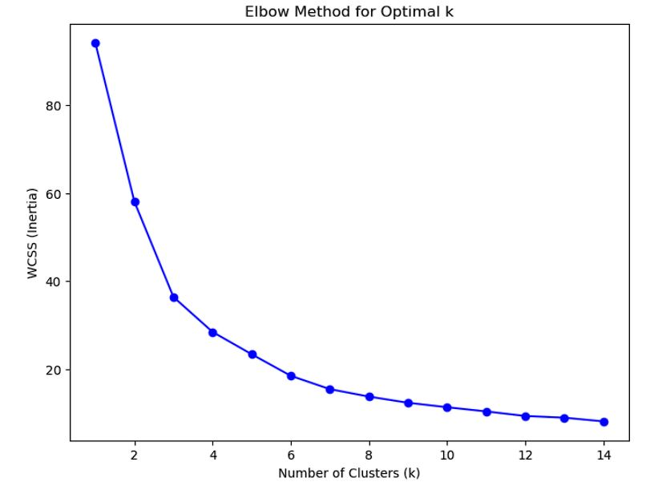
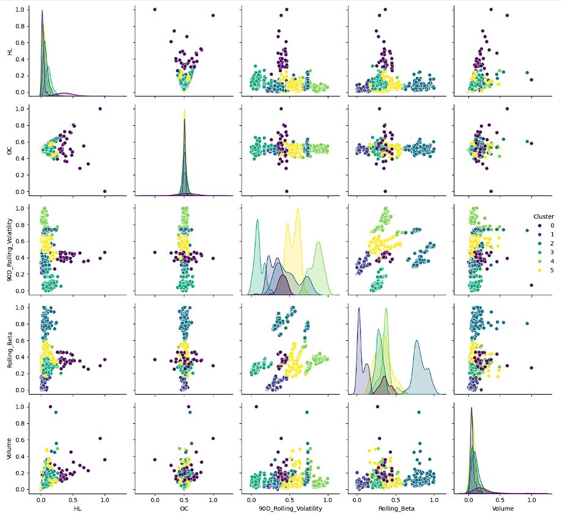
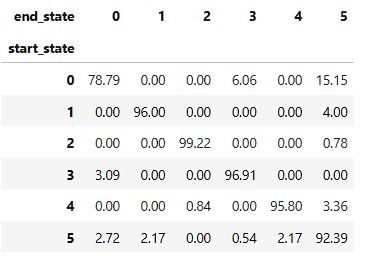

# Markov Model for Stocks
Building Markov Model for Stocks after applying Clustering to Time Series data in Python

 

## 1. Applying k-means clustering to identify market states
1. Data Preparation
2. Feature Preparation
3. **Check for Multicollinearity**
4. **Normalize** (as some features might dominate due to larger scale) w/ `MinMaxScaler`
5. **Finding Optimal k** w/ WCSS or **elbow method**
6. Perform Silhouette analysis for different k
7. Fit the model and identify the clusters
8. Analyzing clusters
9. Analyzing each cluster

 

**Finding Optimal k with elbow method**

 

**Pairwise Feature Relationships by Cluster**

 

#### [View Clustering](https://github.com/s1dewalker/Markov-Model-for-Stocks/blob/main/py_files/MarkovModel1_Clustering2.ipynb)
 

Python libraries used: `pandas`, `yfinance`, `sklearn`, `matplotlib`, `seaborn`

 

## 2. Building Markov Model to create a Transition matrix
1. Get previous state
2. Create Transition State by combining previous and present states
3. Grouping by Transition state and Counting their occurrences
4. Separate the transition state
5. Create Markov transition matrix 
6. Convert to row-wise percentages (%)

 

 

#### [View Model](https://github.com/s1dewalker/Markov-Model-for-Stocks/blob/main/py_files/MarkovModel2-Building_MarkovModel.ipynb)
 

Python libraries used: `pandas`
